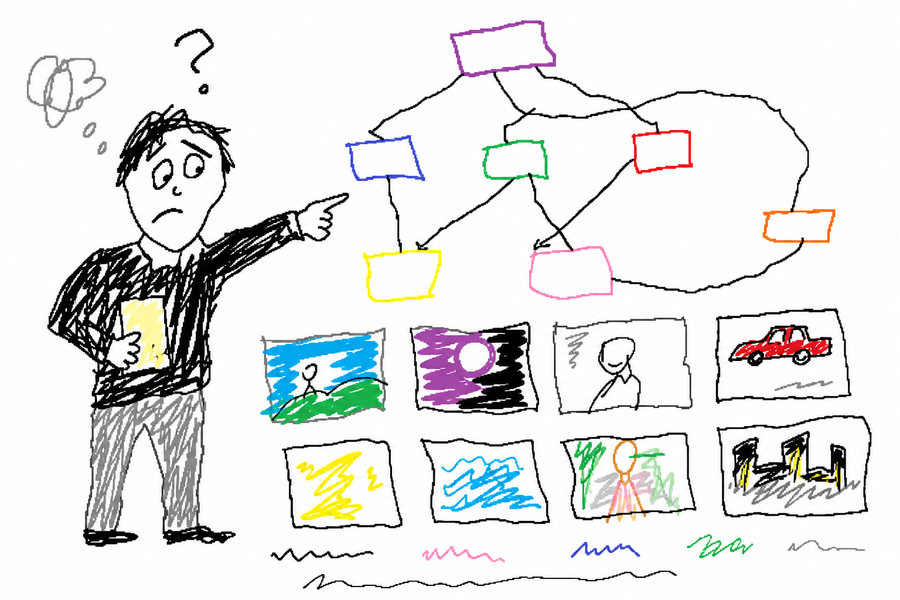

# Скилл Art Director



Итеративный поиск визуального стиля для медиа-ассетов: промпты веток, журнал процесса, граф решений, цикл комментариев и финальный выбор направления.

## Проблема

Визуальный поиск часто распадается в чате: варианты сгенерированы, комментарии получены, следующий проход забывает, что выбрали, отклонили и унесли дальше.

## Решение

Скилл превращает style brief в кластеры вариантов, preview, заметки выбора, следующие ветки и воспроизводимый журнал процесса.

## Что скилл создаёт

- Prompt-файлы для каждой ветки
- Process logs с безопасными summaries комментариев
- Style-system notes
- Папки assets для generated или collected variants
- HTML-preview с decision graph
- Selection records с carry-forward и drop rules
- Стартовый HTML-шаблон `assets/style-search-map-template.html`

## Когда применять

- Поиск визуального направления
- Исследование стиля для image generation
- Эксперименты для обложек, постеров, каруселей, комиксов или видео
- HTML-preview с графом решений
- Комментарии ревьюера, которые должны стать следующими ветками
- Финальный выбор стиля с правилами carry-forward и drop

## Форма результата

Типичный прогон живёт в `art-direction/<project>/`:

```text
art-direction/<project>/
  prompts/vNN/YYYY-MM-DD-vNN-<slug>-prompts.md
  process/vNN/YYYY-MM-DD-vNN-<slug>-log.md
  styles/YYYY-MM-DD-<style-system>.md
  assets/vNN-<slug>/
  vNN-<slug>.html
```

Preview начинается с iteration-cluster graph: идея, checkpoints, option leaves, выбранные узлы, отклонённые узлы, outputs и следующие ветки.

## Первый запуск

В пустом media workspace:

```bash
mkdir -p art-direction/<project>/{prompts/v01,process/v01,styles,assets/v01-style-search}
cp skills/art-director/assets/style-search-map-template.html art-direction/<project>/v01-style-search.html
python3 -m http.server 8080
```

Открой `http://127.0.0.1:8080/art-direction/<project>/v01-style-search.html` и замени sample cluster data на текущий brief.

## Рабочий цикл

1. Прочитать существующие project files.
2. Определить активный style question.
3. Собрать iteration cluster до генерации вариантов.
4. Написать branch prompts с difference axes и reject criteria.
5. Сгенерировать или собрать assets через approved path host repo.
6. Отрендерить decision graph и preview cards.
7. Превратить feedback в следующий branch set.
8. Записать выбранное направление и next action.

## Контракт decision graph

Граф должен показывать метод: root idea, iteration checkpoints, option leaves, selected nodes, rejected nodes, outputs, безопасные summaries комментариев, carry-forward rules, dropped motifs и next branches.

## Safety и границы источников

Публичный скилл generic. В host repo нужно держать приватные чаты, скриншоты, auth material, billing records, customer records, infrastructure details, non-public repository links и небезопасные источники вне промптов и публичных preview.

## Проверка

Запусти checks из [SKILL.md](SKILL.md) для текущего прохода. Минимум: HTML-preview существует, graph terms присутствуют, prompt и process files созданы, `git diff --check` проходит.

## Установка

```bash
cp -r skills/art-director ~/.claude/skills/
```

После этого скилл доступен в Claude Code.

## Как запустить

Скажи агенту:

> «Используй art-director и исследуй три визуальных направления для этой медиа-кампании».

Или:

> «Запусти art-director на этом preview и преврати мой комментарий в следующие style branches».

## См. также

- [SKILL.md](SKILL.md) - полная спецификация скилла
- [README.md](README.md) - English version
