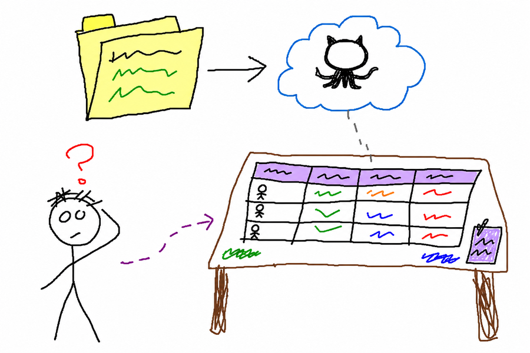

# Скилл Corp New



Создаёт или проверяет приватный репозиторий отдела `corp-*` и регистрирует его в локальном HQ Markdown-файле.

## Проблема

Работа основателя или небольшой компании быстро расходится по функциональным отделам: media, legal, sales, analytics, operations. Каждому отделу нужен репозиторий-владелец, приватный GitHub remote и одна строка в HQ-индексе, чтобы агенты знали, где живёт source of truth.

## Решение

`corp-new` превращает название отдела в безопасный повторяемый процесс настройки:

- нормализует `corp-*` slug;
- проверяет локальное состояние, GitHub и HQ перед изменениями;
- создаёт или клонирует приватный GitHub-репозиторий;
- сохраняет dirty worktree и существующую историю;
- добавляет ровно одну HQ-строку с локальной и GitHub-ссылкой;
- проверяет visibility, default branch, remote и HQ-регистрацию.

## Что скилл может изменить

После явного подтверждения скилл может создать локальную папку, выполнить `git init`, создать приватный GitHub-репозиторий, клонировать существующий репозиторий, закоммитить минимальный README, запушить закоммиченную работу, сделать `fetch` из origin и изменить одну строку HQ-таблицы.

## Конфигурация

Передайте значения в prompt, project instructions или переменные окружения:

| Значение | Env var | Пример |
|---|---|---|
| Название отдела | `DEPARTMENT_LABEL` | `Media` |
| Домен отдела | `DEPARTMENT_DOMAIN` | `media assets and publishing workflows` |
| GitHub owner или org | `GITHUB_OWNER` | `your-org` |
| Root локальных репозиториев | `CORP_REPOS_ROOT` | `~/Documents/GitHub` |
| HQ Markdown-файл | `HQ_FILE` | `~/Documents/ops/AGENTS.md` |
| Префикс репозитория | `REPO_PREFIX` | `corp-` |
| Опциональный slug | `DEPARTMENT_SLUG` | `corp-media` |

Скилл спросит перед изменениями, если неизвестны название отдела, домен отдела, GitHub owner или HQ-файл. Репозитории по умолчанию приватные.

HQ-файл должен содержать или принимать таблицу отделов с колонками: название отдела, ссылки на репозиторий и короткий домен.

## Примеры

```text
Use corp-new to create a Media department. Owner is my-org, repos live in ~/Documents/GitHub, HQ file is ~/Documents/company/AGENTS.md, domain is "media assets and publishing workflows". Show the dry run and ask before creating the repo or editing HQ.
```

```text
Use corp-new to verify corp-analytics already exists locally and on GitHub, then register it in our HQ file.
```

```text
Use corp-new to clone my-org/corp-legal into my workspace and add the HQ department row.
```

## Safety Model

- Создаёт приватные репозитории по умолчанию.
- Показывает dry-run summary перед изменениями.
- Сохраняет существующие папки и dirty worktree.
- Не делает force-push, reset, deletion и не отбрасывает пользовательские изменения.
- Не редактирует архивные и исторические папки.
- Оставляет HQ индексом и ссылается на репозиторий-владелец вместо копирования содержимого отдела.

## Установка

```bash
cp -r skills/corp-new ~/.claude/skills/
```

## См. также

- [SKILL.md](SKILL.md) — полный workflow и проверки
- [project-init](../project-init/) — первичная настройка GitHub operating system
- [task-routing](../task-routing/) — маршрутизация issues между существующими репозиториями
