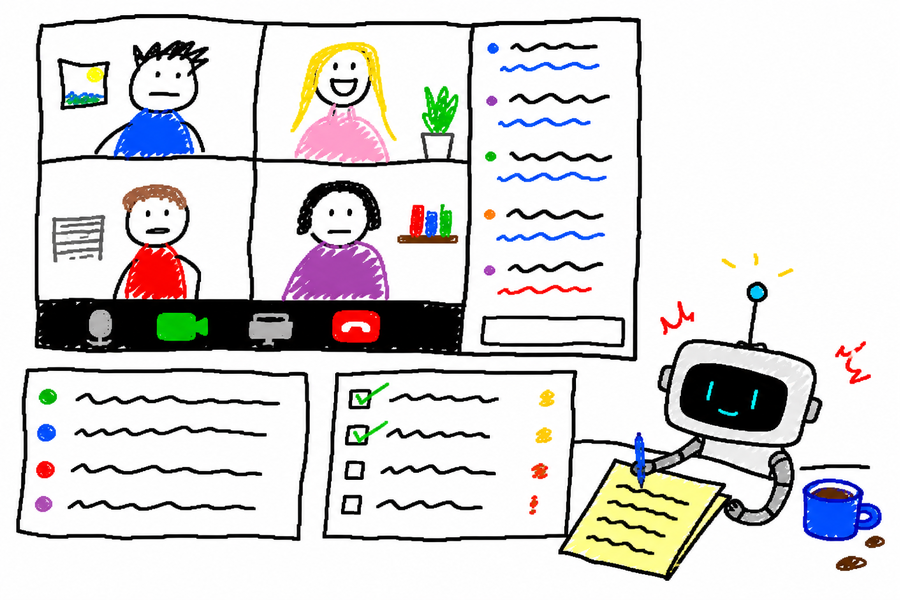

# Meeting Copilot Skill



Скилл для live-встреч: локальный HTML-дашборд, который агент обновляет по ходу звонка.

## Проблема

Во время звонка легко потерять важные вопросы, решения, риски и follow-up. Транскрипт полезен после встречи, но плохо помогает вести разговор в моменте.

## Решение

Агент создаёт локальный dashboard перед встречей, обновляет его из кусков транскрипта во время звонка и закрывает сессию в структурированное саммари.

Основной цикл:
- **CREATE** — подготовить briefing, вопросы, карту тем и follow-up
- **UPDATE** — превратить дельту транскрипта в обновления dashboard
- **CLOSE** — вынести решения, action items, открытые вопросы и follow-up draft

## Установка

```bash
cp -r skills/meeting-copilot ~/.claude/skills/
```

## Примеры

```text
Create a meeting copilot for tomorrow's discovery call with Company X.
```

```text
Update the meeting copilot with this transcript chunk.
```

```text
Close the session and create a sanitized summary I can share publicly.
```

## Приватность

Скилл рассчитан на приватные workspace. Сырые транскрипты, имена, приватные ссылки, CRM-данные и внутренние пути нельзя выносить в публичные артефакты без явной sanitization.

## См. также

- [SKILL.md](SKILL.md) — полное описание скилла
