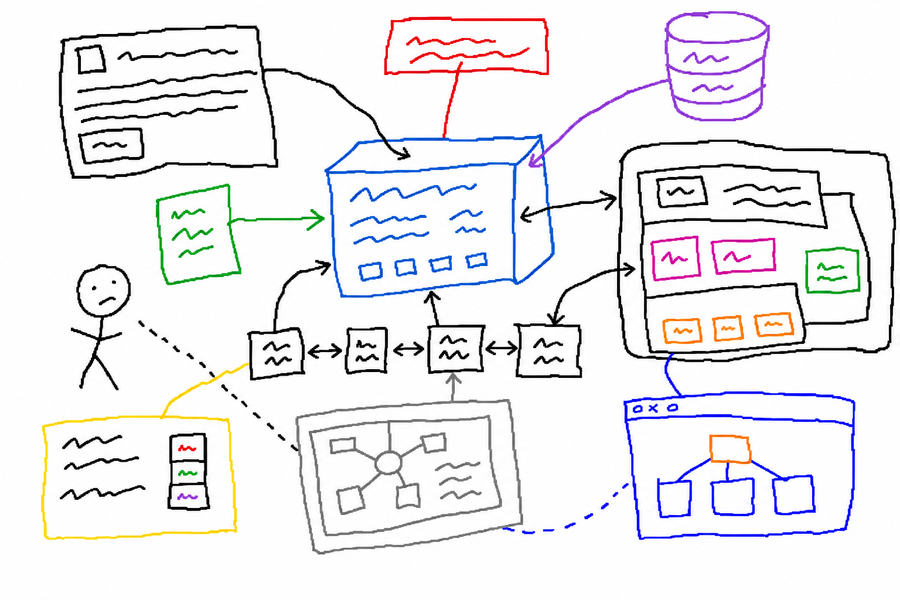

# Ris Draft Skill



Скилл генерирует одну HTML-страницу с технической диаграммой в стиле плоского инженерного чертежа — как распечатанный spec sheet, не как маркетинговый лендинг.

## Что это

Ты говоришь агенту «нарисуй мне архитектуру моей системы» — получаешь один файл `.html`, который открывается в любом браузере и выглядит как страница из инженерной документации: чёрно-белые контуры, моноширинные подписи, без теней и градиентов.

**Стек:** Tailwind v4 через `@tailwindcss/browser` CDN (utility-классы + дизайн-токены) и D3 v7 через jsDelivr CDN (SVG-диаграммы). Из шрифтов — только системные, без Google Fonts.

## Когда применять

- Нужна **архитектура системы** — сервисы, поток данных, зависимости
- Нужен **system flow** — последовательность шагов процесса с развилками
- Нужен **technical spec sheet** — сетка ячеек с параметрами и значениями
- Нужна **карта компонентов** — вложенные блоки родитель → дети

Не подходит:
- Если нужна обычная mermaid-схема прямо внутри markdown — это другой инструмент
- Если хочешь газетный текстовый лонгрид с моноширинным шрифтом — это другой стиль
- Если нужен многошаговый интерактивный экспейнер с навигацией — это другой формат

## Что получишь на выходе

Один файл `diagram.html` (или название по теме) — открывается в современном браузере с доступом в интернет (для загрузки Tailwind + D3 CDN). Экспортируется в PDF, встраивается в презентацию iframe или скриншотом.

В файле:
- Заголовок и подзаголовок (UPPERCASE моноширинно)
- Сама диаграмма внутри `.diagram-canvas` (canvas с рамкой и отступами)
- Подписи sans-serif, данные/пути/коды/ID — моноширинно
- Сплошные линии = структурные связи, пунктир = логические/абстрактные
- Опционально — бейджи (контурные или залитые) с короткими метками

## Установка

```bash
cp -r skills/ris-draft ~/.claude/skills/
```

После этого скилл доступен в Claude Code.

## Как запустить

Просто скажи агенту, что хочешь — естественным языком:

> «Нарисуй мне blueprint моей системы публикации: входящие источники → парсинг → дистилляция → файл в папке. Выведи в /tmp/pipeline.html»

Или:

> «Сделай технический чертёж pipeline для еженедельного дайджеста»

Или явно через slash-команду: `/ris-draft`

Агент:
1. Если описание неполное — задаст 1-2 уточняющих вопроса (тип диаграммы, список узлов)
2. Сгенерирует один HTML-файл по фиксированному визуальному канону
3. Файл откроется в браузере как есть — без сборки, без зависимостей

## Правила стиля (что зашито в скилл)

- Плоско: никаких теней, градиентов, glassmorphism, blur
- Контурно: 1-2px solid borders задают структуру
- Монохромно: чёрный + серый + один semantic-цвет (например, красный для ошибки) точечно
- Системные шрифты: никакого Google Fonts (Tailwind + D3 CDN — единственные внешние зависимости)
- Дизайн-токены задаются один раз в `@theme` блоке; всё остальное — Tailwind utility-классы
- D3 — для SVG-диаграмм (узлы, коннекторы, layouts); по умолчанию статика, интерактив только по явному запросу

## См. также

- [SKILL.md](SKILL.md) — полная спецификация скилла с примерами CSS-токенов и шаблоном HTML
- [README.md](README.md) — English version
